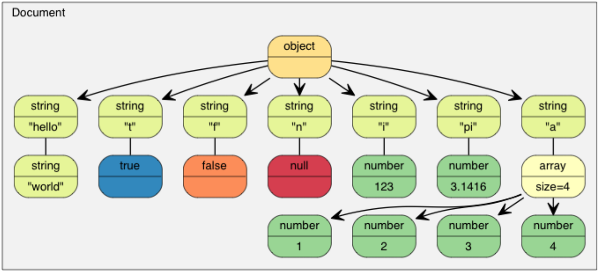
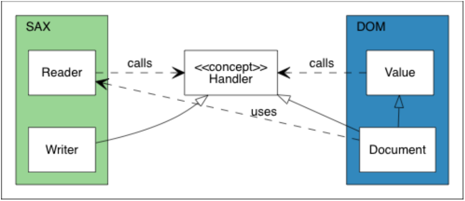

# Mudong-JSON : A JSON parser/generator for C++17

[](https://github.com/moonlightleaf/mudong-json/actions/workflows/cmake-single-platform.yml)

## 项目简介

mudong-json是一款基于C++17开发的JSON解析/生成器，采用递归下降的方式进行解析，支持`DOM(Document Object Model)`和`SAX(Simple API for XML)`两种API风格:

* `DOM`是一种基于树状结构的JSON解析模型。在DOM解析中，整个JSON文件被加载到内存中并表示为一个树状结构的对象模型，JSON中的每个元素都对应一个节点，这些节点可以通过编程接口进行访问、遍历和修改。DOM解析允许应用程序以树状结构的方式直接操作JSON数据，但可能需要更多的内存和计算资源，尤其是对于大型文档。DOM的优点是易于编写代码和操作，特别适用于需要频繁随机访问JSON数据的情况。
* `SAX`是一种基于事件的JSON解析模型。在SAX解析中，JSON文档被顺序解析，当解析器遇到特定的JSON元素或事件（如开始标签、结束标签、文本内容等）时，它会触发相应的事件，从而允许应用程序在处理过程中做出响应。SAX解析器一次只解析文档的一部分，因此适用于处理大型JSON文档，因为它不需要将整个文档加载到内存中。SAX的优点是效率高，占用的内存少，但在代码编写上通常需要更多的处理逻辑。

以如下JSON字符串为例：
```json
{
    "hello": "world",
    "t": true ,
    "f": false,
    "n": null,
    "i": 123,
    "pi": 3.1416,
    "a": [1, 2, 3, 4]
}
```
其DOM树构建为：

<div align="center">
  
  <p>DOM树</p>
</div>

本项目的开发和测试环境为：Ubuntu 20.04 (WSL2)、gcc 9.4.0 -std=c++17、cmake 3.16.3。

## 项目架构

mudong-json定义有三个核心concept，分别是`ReadStream`、`WriteStream`和`Handler`:

* `ReadStream`用于读取字符流，目前实现了`StringReadStream`和`FileReadStream`分别用于从内存和文件中读取字符。
* `WriteStream`用于输出字符流，目前实现了`StringWriteStream`和`FileWriteStream`分别用于向内存和文件中输出字符。
* `Handler`是解析和生成时，用于事件触发和执行的对象，目前实现了SAX风格的`Writer`用于向`WriteStream`输出字符，以及DOM风格的`Document`用于构建JSON对象的树形存储结构。

其中，`ReadStream`和`WriteStream`的实现只能为`StringXXX`和`FileXXX`，通过`enable_if_t`进行编译期模板参数类型检查；`Handler`除现有实现外，支持自定义，以进行定制化操作。

<div align="center">
  
  <p>架构UML类图</p>
</div>

关系的核心是`Handler`概念。在SAX一边，`Reader`从流解析JSON并将事件发送到`Handler`。`Writer`实现了`Handler`概念，用于处理相同的事件。在DOM一边，`Document`实现了`Handler`概念，用于通过这些事件来构建DOM。在这个设计，SAX是不依赖于DOM的。甚至`Reader`和`Writer`之间也没有依赖。这提供了连接事件发送器和处理器的灵活性。除此之外，`Value`也是不依赖于SAX的。所以，除了将DOM序列化为JSON之外，用户也可以将其序列化为XML，或者做任何其他事情。

## 值（Value）

mudong-json中自定义了可变类型数据存储类`Value`，其设计类似于QT中的QVariant和C++17中的Variant，json文档中的每一个元素（DOM树状结构上的叶子节点或子树）都可以用`Value`来存储，是DOM API的核心。其内部维护一个union来存储数据并节约存储空间：
```cpp
union {
    bool                b_;
    int32_t             i32_;
    int64_t             i64_;
    double              d_;
    StringWithRefCount* s_;
    ArrayWithRefCount*  a_;
    ObjectWithRefCount* o_;
};
```
并使用`enum class`定义了`ValueType`来表示当前`Value`的类型，防止命名空间污染：
```cpp
enum class ValueType {
    TYPE_NULL,
    TYPE_BOOL,
    TYPE_INT32,
    TYPE_INT64,
    TYPE_DOUBLE,
    TYPE_STRING,
    TYPE_ARRAY,
    TYPE_OBJECT
};
```
`Value`内部定义了`isXXX()`、`getXXX()`和`setXXX([args])`，分别用来判断类型、访问成员和修改成员（XXX可为Null、Bool、Int32、Int64、Double、String、Array和Object）。其中getXXX()中对类型断言判断以进行类型检查，若Value本身类型与getXXX()类型不一致，在Debug模式下将因断言失败而崩溃。

## 使用示例

### 1. 读写JSON

DOM风格API使用示例如下：
```cpp
#include <Document.hpp>

#include <iostream>

int main() {
    json::Document doc;
    auto err = doc.parse("{"
    "    \"precision\": \"zip\","
    "    \"Latitude\": 37.766800000000003,"
    "    \"Longitude\": -122.3959,"
    "    \"Address\": \"\","
    "    \"City\": \"SAN FRANCISCO\","
    "    \"State\": \"CA\","
    "    \"Zip\": \"94107\","
    "    \"Country\": \"US\""
    "    }");

    if (err != json::ParseError::PARSE_OK) {
        std::cerr << json::parseErrorStr(err) << std::endl;
        exit(1);
    }

    //get "Country" field
    //使用operator[](const std::string_view&)必须确保doc树中必须包含"Country"的成员，否则将断言失败
    json::Value& country = doc["Country"];
    std::cout << country.getStringView() << std::endl;
    //更安全的做法是使用Document.findMember(const std::string_view& key)
    json::Value::MemberIterator countryIter = doc.findMember("Country");
    if (countryIter != doc.endMember()) {
        std::cout << countryIter->value.getStringView() << std::endl;
    }

    //set "Address"
    json::Value& addr = doc["Address"];
    addr.setString("Block 1, Street 2");
    std::cout << addr.getStringView() << std::endl;
}
```
输出
```
US
US
Block 1, Street 2
```
Document继承自Value，即Document是一个Value，可以使用`isXXX()`、`getXXX()`和`setXXX([args])`来进行操作和判断。对于`json::ValueType::TYPE_ARRAY`类型的Value，可以使用`operator[](const std::string_view&)`便捷地访问或修改Value的成员，但调用方必须确保想要获取的成员确切存在。倘若不确定，更安全的做法是使用`Document.findMember(const std::string_view& key)`，来根据key查找指向该key所对应value的迭代器，倘若不为`Document.endMember()`则说明存在，并可通过返回的迭代器访问和修改value。对于小型的JSON文档，使用DOM风格的API更加方便和简洁。

SAX风格API使用示例如下：
```cpp
#include <FileReadStream.hpp>
#include <FileWriteStream.hpp>
#include <Writer.hpp>
#include <Reader.hpp>
#include <noncopyable.hpp>
#include <Exception.hpp>

#include <iostream>

template<typename Handler>
class AddOne: json::noncopyable {
public:
    bool Null()                { return handler_.Null(); }
    bool Bool(bool b)          { return handler_.Bool(b); }
    bool Int32(int32_t i32)    { return handler_.Int32(i32 + 1); } // add one
    bool Int64(int64_t i64)    { return handler_.Int64(i64 + 1); } // add one
    bool Double(double d)      { return handler_.Double(d + 1); }  // add one
    bool String(std::string_view s) { return handler_.String(s); }
    bool StartObject()         { return handler_.StartObject(); }
    bool Key(std::string_view s)    { return handler_.Key(s); }
    bool EndObject()           { return handler_.EndObject(); }
    bool StartArray()          { return handler_.StartArray(); }
    bool EndArray()            { return handler_.EndArray(); }

    explicit AddOne(Handler& handler): handler_(handler) { }

private:
    Handler& handler_;
};

int main() {
    json::FileReadStream is(stdin);
    json::FileWriteStream os(stdout);
    json::Writer writer(os);
    AddOne addOne(writer);

    json::ParseError err = json::Reader::parse(is, addOne);
    if (err != json::ParseError::PARSE_OK) {
        std::cerr << json::parseErrorStr(err) << std::endl;
        exit(1);
    }
}
```
`stdin`输入：
```
{"s":"string", "a":10, "d":10.0}
```
`stdout`输出
```
{"s":"string","a":11,"d":11.0}
```
本示例中，在`Writer`的基础上实现了新的`Handler AddOne`，将JSON文档中的所有数字加1。自定义`Handler`只需保证和原有`concept`一致即可，拥有相同的接口。将不同功能的`Handler`串联起来，可实现自定义功能。使用SAX风格对JSON进行解析和操作时，无需创建DOM树，每一步通过事件进行触发，处理时内存占用不受JSON文档大小的影响，适用于大型JSON文档的流式处理。

### 2. 生成JSON

```cpp
#include <FileWriteStream.hpp>
#include <Writer.hpp>

#include <iostream>

int main() {
    json::FileWriteStream os(stdout);
    json::Writer writer(os);

    writer.StartObject();
    writer.Key("B");
    writer.StartArray();
    writer.String("ByteDance");
    writer.String("BaiDu");
    writer.EndArray();
    writer.Key("A");
    writer.String("Alibaba");
    writer.Key("T");
    writer.String("Tencent");
    writer.EndObject();
}
```
输出：
```
{"B":["ByteDance","BaiDu"],"A":"Alibaba","T":"Tencent"}
```
创建好`WriteStream`并交由`Handler`后，调用相应接口即可生成JSON文档。

## 测试&&性能

mudong-json使用[Google Test](https://github.com/google/googletest)和[Google Benchmark](https://github.com/google/benchmark)进行测试，测试程序见`test`和`bench`目录，测试JSON文件为fastjson提供的真实淘宝网数据。

## 编译&&使用

```shell
$ git clone https://github.com/moonlightleaf/mudong-json.git
$ cd mudong-json
$ git submodule update --init --recursive
$ mkdir build && cd build
$ cmake [-DCMAKE_BUILD_TESTS=1] [-DCMAKE_BUILD_BENCHMARK=1] [-DCMAKE_BUILD_EXAMPLES=1] ..
$ make
```
可以通过选择是否添加`-DCMAKE_BUILD_TESTS=1`、`-DCMAKE_BUILD_BENCHMARK=1`、`-DCMAKE_BUILD_EXAMPLES=1`选项，来决定是否要对`test`、`bench`和`example`目录下的文件进行编译。mudong-json只包含头文件，在使用时，只需将mudong-json的头文件拷贝至新项目的`include`路径下即可。

## 参考

- [RapidJSON](https://github.com/Tencent/rapidjson): A fast JSON parser/generator for C++ with both SAX/DOM style API.
- [JSON tutorial](https://github.com/miloyip/json-tutorial): 从零开始的 JSON 库教程.
